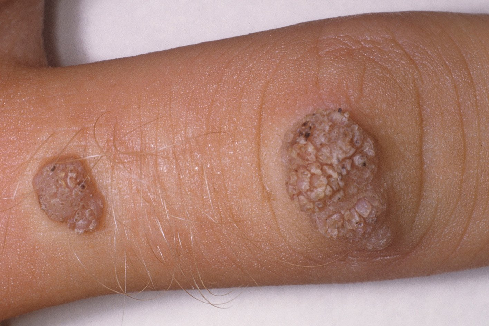
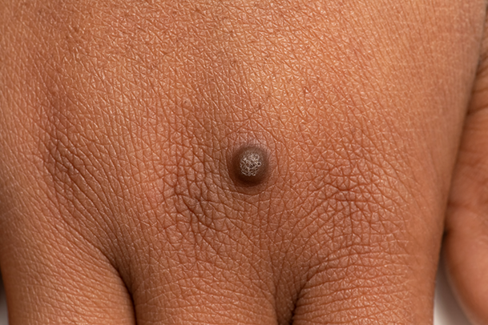
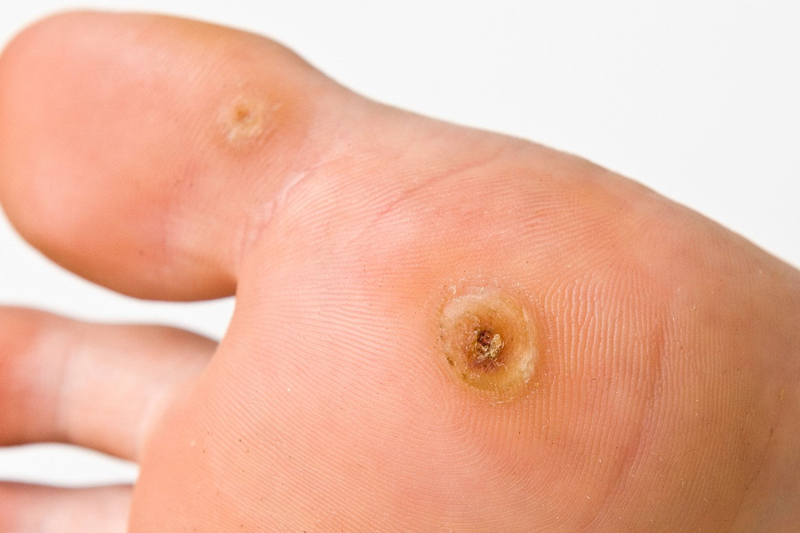
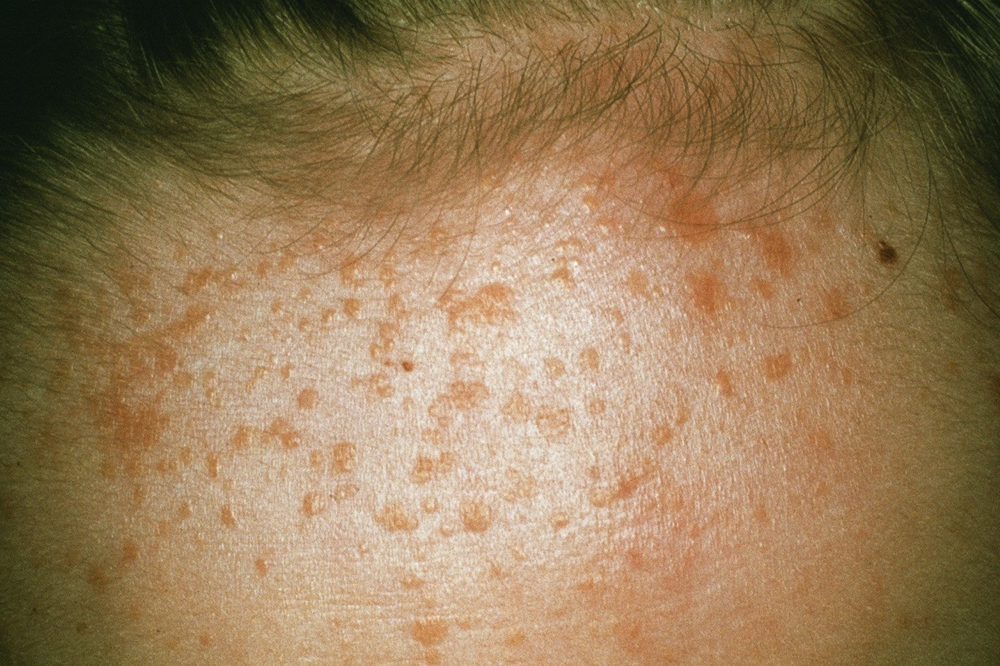
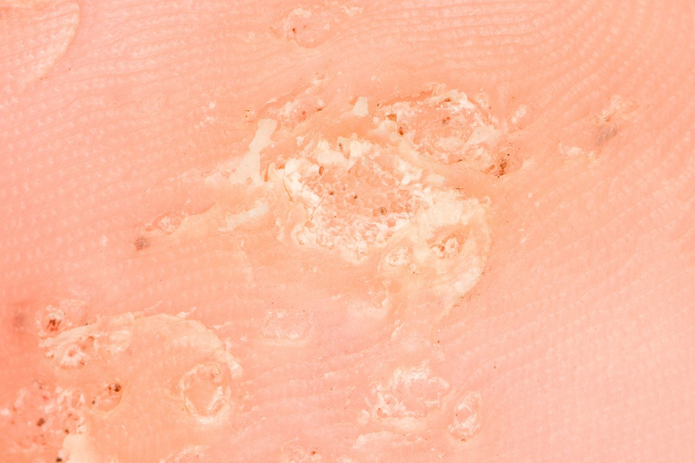

<!-- Warts-and-verrucas -->

# Warts and verrucas

**Warts and verrucas are small lumps on the skin that most  people have at some point in their life. They usually go away on their  own but may take months or even years.**

## Check if you have a wart or verruca

          Warts feel firm and rough. They can appear on palms, knuckles, knees and fingers             
<!-- FIXME: IMG-SRC https://www.nhs.uk/conditions/warts-and-verrucas/ -->

          Warts are usually skin coloured but may appear darker on dark skin             
<!-- FIXME: IMG-SRC https://www.nhs.uk/conditions/warts-and-verrucas/ -->

          Verrucas appear on your feet. They have tiny black dots under the hard skin             
<!-- FIXME: IMG-SRC https://www.nhs.uk/conditions/warts-and-verrucas/ -->

          Some warts are round, flat and can be yellow (plane warts). You can have many of them             
<!-- FIXME: IMG-SRC https://www.nhs.uk/conditions/warts-and-verrucas/ -->

          Clusters of warts, spread over an area of skin (mosaic warts) are common on feet and hands             
<!-- FIXME: IMG-SRC https://www.nhs.uk/conditions/warts-and-verrucas/ -->

Warts do not cause you any harm, but some people find them  itchy, painful or embarrassing. Verrucas are more likely to be painful – like standing on a needle.

You can treat warts if they bother you, keep coming back or are painful.

## A pharmacist can help with warts and verrucas

You can buy creams, plasters and sprays from pharmacies to treat warts and verrucas.

These treatments can take up to 3 months to complete, may irritate your skin  and do not always work. You should not use these treatments on your  face.

Your pharmacist can give you advice about the best treatment for you.

[Find a pharmacy](https://www.nhs.uk/service-search/find-a-pharmacy)

> ### **See a GP if:**
>
> - you're worried about a growth on your skin
> - you have a wart or verruca that keeps coming back
> - you have a very large or painful wart or verruca
> - a wart bleeds or changes in how it looks
> - you have a wart on your face or genitals
>

[Genital warts](https://www.nhs.uk/conditions/genital-warts/) can be treated at a sexual health or GUM clinic.

[Find your nearest sexual health service](https://www.nhs.uk/service-search/sexual-health/find-a-sexual-health-clinic)

## Treatment from a GP

A GP may be able to freeze a wart or verruca so it falls off a few weeks later. Sometimes it takes a few sessions.

Check with the GP if the NHS pays for this treatment in your area.

If treatment has not worked or you have a wart on your face, the GP might  refer you to a skin specialist. Other treatments include minor surgery  and treatment with laser or light.

## How to stop warts and verrucas spreading

Warts and verrucas are caused by a virus. They can be spread  to other people from contaminated surfaces or through close skin  contact. You're more likely to spread a wart or verruca if your skin is  wet or damaged.

It can take months for a wart or verruca to appear after contact with the virus.

> ### **Do**  
>
> - wash your hands after touching a wart or verruca
> - change your socks daily if you have a verruca
>
> - cover warts and verrucas with a plaster when swimming
> - take care not to cut a wart when shaving
>
> ### **Don’t**  
>
> - do not share towels, flannels, socks or shoes if you have a wart or verruca
> - do not bite your nails or suck fingers with warts on      
>
> - do not walk barefoot in public places if you have a verruca
>
> - do not scratch or pick a wart

***Page last reviewed: 14 October 2020  
Next review due: 14 October 2023  
Source link: <https://www.nhs.uk/conditions/warts-and-verrucas/>  
Source license: [Open Government License](http://www.nationalarchives.gov.uk/doc/open-government-licence/version/3/)***
