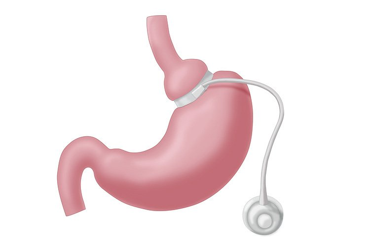
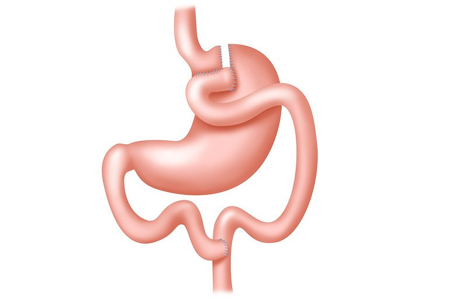
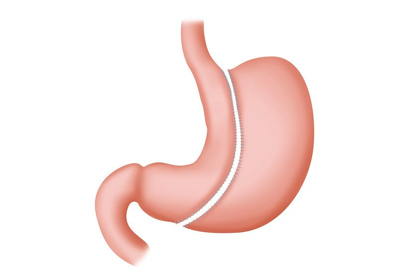

<!-- weight-loss-surgery-types -->

# **Types**

> ## Weight loss surgery

- [Overview](weight-loss-surgery.md)
- [Availability](weight-loss-surgery-who-can-have-it.md)
- **Types**
- [Afterwards](weight-loss-surgery-afterwards.md)
- [Risks](weight-loss-surgery-risks.md)

**There are several different types of weight loss surgery.**

They're all usually done under [general anaesthetic](general-anaesthesia.md) (where you're asleep) using [keyhole (laparoscopic) surgery](laparoscopy.md), but they each work in a slightly different way.

Keyhole surgery is where a surgeon makes small cuts in the tummy and inserts a  flexible viewing tube so they can see inside while performing the  operation.

## Main types of weight loss surgery

### Gastric band

             

A gastric band is a band that's placed around the stomach, creating a small pouch towards the top.

It takes less food to fill the pouch, so you do not need to eat as much before you feel full.

The band is connected to a small device placed under the skin (usually near the middle of the chest). This is so the band can be tightened after  surgery.

The band will usually be tightened for the first time  about 4 to 6 weeks after surgery. This is done by injecting the device  with salt water solution using a needle passed through your skin. You do not usually need any anaesthetic for this.

The band will need to be tightened a few times to get to the ideal tightness for you.

### Gastric bypass

             

A gastric bypass is where surgical staples are used to create a small pouch at the top of the stomach.

The pouch is then connected to your small intestine, missing out (bypassing) the rest of the stomach.

This means it takes less food to make you feel full and you'll absorb fewer calories from the food you eat.

### Sleeve gastrectomy

             

A sleeve gastrectomy is where a large part of the stomach is removed so it's much smaller than it was before.

This means you cannot eat as much as you could before surgery and you'll feel full sooner.

### Intra-gastric balloon

An intra-gastric balloon is a soft balloon filled with air or salt water  that's placed into your stomach using a thin tube passed down  your throat (known as a [gastroscopy](gastroscopy.md)).

This means you will not need or be able to eat as much before you feel full. But it's only a temporary measure and the balloon is usually left in  for a maximum of 6 months.

### Biliopancreatic diversion

A  biliopancreatic diversion is similar to a gastric bypass, except the  stomach pouch is connected further along the small intestine.

This means you'll absorb even fewer calories from the food you eat. But it  can cause more side effects than a gastric bypass, so it's less commonly used.

### Primary obesity surgery endolumena

Primary obesity  surgery endolumena is a new technique to shrink your stomach. A tube  called an endoscope is passed into your stomach.

A surgeon then passes tiny tools through the endoscope, which are used to gather your stomach into folds to make it smaller.

Primary obesity surgery endolumena is not currently available on the NHS so you will have to pay for this treatment.

## Which type of weight loss surgery is best?

All types  of weight loss surgery can help you lose a significant amount of weight, but they each have advantages and disadvantages.

For example:

- you usually lose weight more quickly after a gastric bypass or sleeve gastrectomy than after gastric banding
- more people tend to achieve significant weight loss with a gastric bypass or sleeve gastrectomy than with a gastric band
- the risk of [serious surgery complications](weight-loss-surgery-risks.md) is generally higher for a gastric bypass or sleeve gastrectomy
- gastric bands are removable, so the operation can be reversed if it causes serious problems

If you're considering weight loss surgery, talk to your surgeon about the different techniques to decide which is best for you.

## Assessment before weight loss surgery

Before you can  have weight loss surgery, you'll be referred to a specialist clinic for  an assessment to check if the operation is suitable.

This may involve checking your:

- physical health – using [blood tests](blood-tests.md), [X-rays](x-ray.md) and scans
- diet and eating patterns
- mental health – such as asking about your expectations of surgery, and whether you have any mental health conditions; this is to assess if you'll be  able to cope with the [long-term lifestyle changes needed after weight loss surgery](weight-loss-surgery-afterwards.md)

You may be advised to have a calorie-controlled diet in the weeks before  surgery to help reduce the size of your liver. This can make surgery  easier and safer.

***Page last reviewed: 14 April 2020  
Next review due: 14 April 2023***
